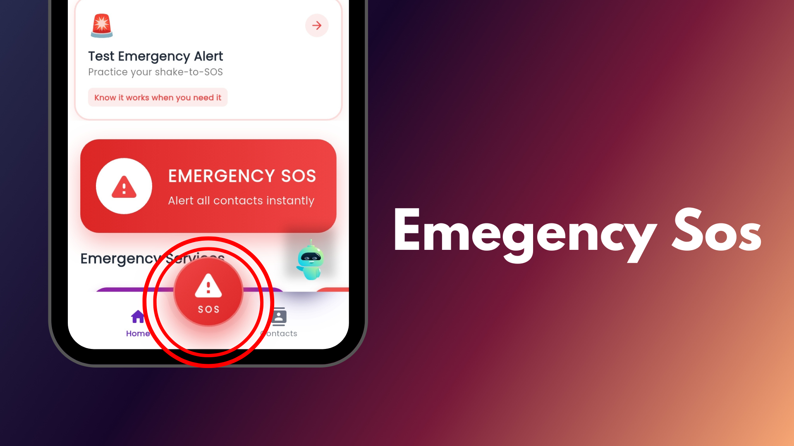
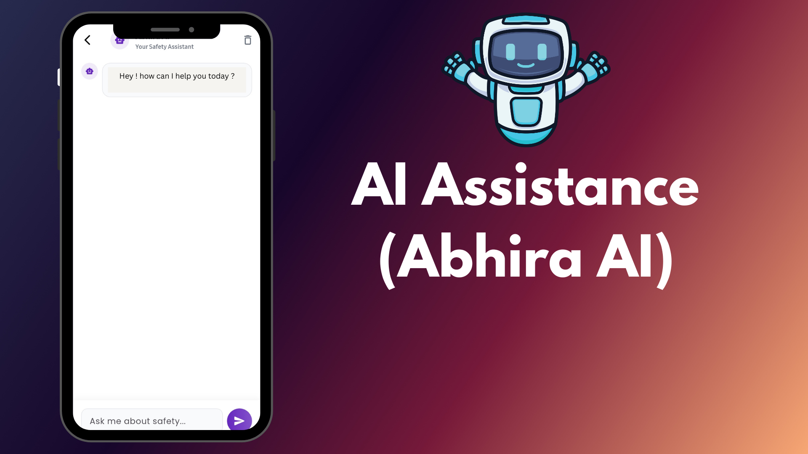
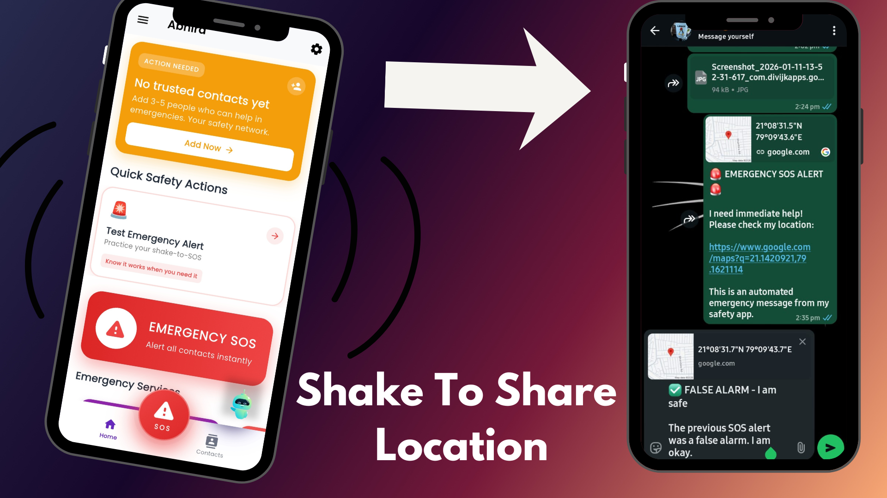

# Abhira - Women's Safety App

<h1 align="center">
  
</h1>

<h1 align="center">🛡️ Abhira - Your Safety, Our Priority</h1>


<p align="center">
  
</p>


<h2 align="center" id="overview"> 💡 About Abhira</h2>

**Abhira** is a comprehensive women's safety application developed to address the critical need for personal security and empowerment. This Flutter-based app provides a complete safety ecosystem with innovative features designed to keep women safe in various situations.

The app combines cutting-edge technology with user-friendly design to create a powerful safety tool that's always at your fingertips. Whether you're traveling alone, in an unfamiliar area, or just want extra peace of mind, Abhira has you covered with features like instant SOS alerts, AI assistance, shake detection, and emergency services integration.

**Key Highlights:**
- 🚨 **One-Tap Emergency SOS** with live location sharing
- 🤖 **AI-Powered Safety Assistant** for guidance and support
- 📳 **Shake-to-Alert** functionality for discreet emergency activation
- 📍 **Real-time Location Tracking** and safe route navigation
- 🔒 **PIN-Protected Controls** to prevent false alarms


<h2 align="center" id="architecture"> 🏗️ Project Architecture</h2>

```
abhira/
├── android/                    # Android native configuration
│   ├── app/
│   │   ├── src/main/
│   │   │   ├── kotlin/com/divijkapps/gosecure/
│   │   │   └── AndroidManifest.xml
│   │   └── build.gradle        # App-level Gradle configuration
│   ├── build.gradle            # Project-level Gradle configuration
│   └── settings.gradle         # Modern Gradle settings
├── lib/                        # Flutter application code
│   ├── main.dart              # App entry point
│   ├── Dashboard/             # Main dashboard screens
│   ├── Onboarding/            # Onboarding flow
│   ├── background_services.dart # Background location & monitoring
│   ├── design_system.dart     # UI design tokens & themes
│   └── constants.dart         # App constants & configurations
├── assets/                     # Static assets
│   ├── icons/                 # App icons
│   ├── lottie/                # Animations
│   ├── qr.png                 # QR code for app sharing
│   └── *.png                  # Images and graphics
├── functions/                  # Firebase Cloud Functions
└── pubspec.yaml               # Flutter dependencies
```


<h2 align="center" id="techstack"> 🛠️ Technology Stack</h2>

```diff
+ Flutter Framework (v3.0+)
+ Dart Programming Language
+ Android Gradle Plugin 8.2.0
+ Kotlin 2.2.0
+ Firebase (Core, Auth, Firestore, Functions)
+ Google Maps API Integration
+ Advanced Sensor Management (Accelerometer)
+ Background Service Processing
+ Real-time Location Tracking (GPS)
+ Audio Processing & Analysis
+ Device Hardware Integration
+ Cross-platform Development
+ State Management (Riverpod)
+ AI Integration (Google Generative AI)
```

**Core Dependencies:**
- **State Management**: `flutter_riverpod`, `provider`
- **Location & Maps**: `google_maps_flutter`, `geolocator`, `geocoding`
- **Sensors**: `sensors_plus`, `sound_mode`
- **Communication**: `url_launcher`, `share_plus`, `permission_handler`
- **Storage**: `shared_preferences`, `sqflite`
- **Background Services**: `flutter_background_service`
- **AI**: `google_generative_ai`
- **UI**: `lottie`, `avatar_glow`, `qr_flutter`


<h2 align="center" id="features"> ✨ Key Features</h2>

### 🚨 Emergency & Safety Features
- **Instant SOS Alerts** - One-tap emergency alerts with live location sharing via WhatsApp
- **Shake Detection** - Automatic alert triggering through device motion sensing
- **PIN Protection** - Secure authentication to prevent false alarm cancellation
- **Emergency Contacts** - Quick access to saved emergency contacts and women's helplines
- **Live Location Sharing** - Real-time location updates for trusted contacts

### 🤖 AI & Smart Features
- **AI Safety Assistant** - Intelligent chatbot for safety guidance and support
- **Voice Commands** - Hands-free operation with speech-to-text integration
- **Smart Context Cards** - Adaptive UI showing relevant safety information

### 🛡️ Security & Privacy
- **Background Monitoring** - Continuous location tracking with battery optimization
- **Permission Management** - Granular control over app permissions
- **Secure Data Storage** - Encrypted local storage for sensitive information

### 🆘 Emergency Services Integration
- **Direct Dialing** - One-tap calling to Police (100), Ambulance (102), Fire Brigade (101)
- **LiveSafe Navigation** - Find and navigate to nearest police stations, hospitals, and safe locations
- **Cab Booking** - Integration with Ola, Uber, and Rapido for safe transportation

### 🔧 Additional Safety Tools
- **Fake Call Generator** - Instant or scheduled fake calls to escape uncomfortable situations
- **Scream Alert** - Loud audio alerts for attention-grabbing in distress situations
- **Camera Detection** - Sensor-based hidden camera detection
- **Complaint System** - File and track safety complaints
- **Safety Articles** - Educational content and awareness resources


<h2 align="center" id="screenshots"> 📱 App Screenshots</h2>

| Feature | Screenshot | Description |
|---------|------------|-------------|
| **Onboarding** |  | Beautiful onboarding experience introducing Abhira's features |
| **Dashboard** |  | Main dashboard with emergency SOS button and quick actions |
| **Emergency SOS** |  | One-tap emergency alert system with location sharing |
| **AI Assistant** |  | Intelligent AI chatbot for safety guidance |
| **Shake Detection** |  | Motion-based automatic alert triggering |
| **Share App** |  | QR code sharing feature for app distribution |

*Note: Screenshots show the actual app interface. The QR code (`assets/qr.png`) is used in the app sharing feature.*


<h2 align="center" id="setup"> 🚀 Installation & Setup</h2>

### Prerequisites
- **Flutter SDK**: `>=3.0.0 <4.0.0`
- **Dart SDK**: `>=3.0.0 <4.0.0`
- **Android Studio**: Latest version with Android SDK
- **Android SDK**: API level 23+ (Android 6.0+)
- **Java JDK**: Version 17 (for Android builds)

### Step-by-Step Setup

1. **Clone the repository:**
   ```bash
   git clone https://github.com/abhishek-mule/UrSafe.git
   cd UrSafe
   ```

2. **Install Flutter dependencies:**
   ```bash
   flutter pub get
   ```

3. **Configure Firebase (Optional but recommended):**
   - Create a Firebase project at [Firebase Console](https://console.firebase.google.com/)
   - Add `google-services.json` to `android/app/`
   - Enable Authentication, Firestore, and Cloud Functions

4. **Configure Android build:**
   ```bash
   # Clean previous builds
   flutter clean

   # Check Flutter environment
   flutter doctor
   ```

5. **Run the app:**
   ```bash
   # For Android device/emulator
   flutter run

   # For specific device
   flutter devices
   flutter run -d <device-id>
   ```

### Build Commands

```bash
# Debug APK
flutter build apk --debug

# Release APK
flutter build apk --release

# App Bundle (recommended for Play Store)
flutter build appbundle --release

# Run tests
flutter test

# Analyze code
flutter analyze
```

### Troubleshooting Common Issues

**Gradle Build Issues:**
```bash
# Clear Gradle cache
cd android
./gradlew clean
./gradlew build --refresh-dependencies

# Reset Flutter
flutter clean
flutter pub cache repair
```

**Permission Issues:**
- Ensure location permissions are granted
- Check Android manifest for proper permissions
- Verify Google Maps API key configuration

**Firebase Issues:**
- Verify `google-services.json` placement
- Check Firebase project configuration
- Ensure proper SHA-1 certificate fingerprints


<h2 align="center" id="dependencies"> 📦 Dependencies</h2>

### Core Dependencies
```yaml
dependencies:
  flutter:
    sdk: flutter

  # State Management
  flutter_riverpod: ^2.4.9
  provider: ^6.1.1

  # Location & Maps
  google_maps_flutter: ^2.5.3
  geolocator: ^11.0.0
  location: ^5.0.3

  # Sensors & Hardware
  sensors_plus: ^7.0.0
  battery_plus: ^5.0.2

  # Communication
  url_launcher: ^6.2.4
  share_plus: ^7.2.2
  permission_handler: ^11.2.0

  # AI & Firebase
  google_generative_ai: ^0.4.0
  firebase_core: ^4.3.0
  cloud_functions: ^6.0.5

  # UI & Animations
  lottie: ^3.0.0
  avatar_glow: ^3.0.1
  qr_flutter: ^4.1.0
  google_fonts: ^6.1.0
```

### Dev Dependencies
```yaml
dev_dependencies:
  flutter_test:
    sdk: flutter
  flutter_lints: ^3.0.1
  flutter_launcher_icons: ^0.13.1
```


<h2 align="center" id="platform"> 📱 Platform Support</h2>

- ✅ **Android**: API 23+ (Android 6.0+) - Fully supported
- ✅ **iOS**: 12.0+ - Compatible (requires testing)
- 🔄 **Cross-platform**: Built with Flutter for potential multi-platform support
- 📊 **Architecture**: Follows Android best practices with modern Gradle configuration

**Android Features:**
- Background services for continuous monitoring
- Native Android permissions handling
- Optimized battery usage for location tracking
- Android 12+ compatibility with modern manifest declarations


<h2 align="center" id="contributing"> 🤝 Contributing</h2>

We welcome contributions to make Abhira even better! Here's how you can help:

### Development Setup
1. Fork the repository
2. Create a feature branch: `git checkout -b feature/amazing-feature`
3. Follow the existing code style and architecture
4. Test your changes thoroughly
5. Submit a pull request

### Code Guidelines
- **Flutter**: Follow [Flutter best practices](https://flutter.dev/docs/development/tools/formatting)
- **Dart**: Use `flutter format` and `flutter analyze`
- **State Management**: Use Riverpod for reactive state management
- **Architecture**: Maintain clean architecture with separation of concerns
- **Documentation**: Add comments for complex logic

### Testing
```bash
# Run unit tests
flutter test

# Run integration tests
flutter drive --target=test_driver/app.dart

# Check code coverage
flutter test --coverage
```

### Reporting Issues
- Use GitHub Issues for bug reports and feature requests
- Include device information, Flutter version, and steps to reproduce
- Attach screenshots or videos for UI-related issues

### Areas for Contribution
- **UI/UX Improvements**: Enhance user interface and experience
- **New Features**: Add safety features based on community feedback
- **Performance Optimization**: Improve app performance and battery usage
- **Testing**: Add comprehensive test coverage
- **Documentation**: Improve code documentation and user guides
- **Localization**: Add support for multiple languages


<h2 align="center" id="license"> 📜 License</h2>

This project is licensed under the MIT License - see the [LICENSE.md](LICENSE.md) file for details.

**Permissions:**
- ✅ Commercial use
- ✅ Modification
- ✅ Distribution
- ✅ Private use

**Limitations:**
- ❌ Liability
- ❌ Warranty

**Conditions:**
- 📝 License and copyright notice


<h2 align="center" id="contact"> 📧 Contact & Support</h2>

**Abhishek Mule** - Project Developer
- 📧 [abhishekmule@example.com](mailto:abhishekmule@example.com)
- 🌐 [GitHub Profile](https://github.com/abhishek-mule)
- 📱 [LinkedIn](https://linkedin.com/in/abhishek-mule)

### Support
- 🐛 **Bug Reports**: [GitHub Issues](https://github.com/abhishek-mule/UrSafe/issues)
- 💡 **Feature Requests**: [GitHub Discussions](https://github.com/abhishek-mule/UrSafe/discussions)
- 📖 **Documentation**: [Wiki](https://github.com/abhishek-mule/UrSafe/wiki)

### Community
- ⭐ **Star** the repository if you find it helpful
- 🍴 **Fork** to contribute your improvements
- 📣 **Share** Abhira with others to help keep women safe


<h2 align="center"> 🎯 Quick Start Commands</h2>

```bash
# One-line setup
git clone https://github.com/abhishek-mule/UrSafe.git && cd UrSafe && flutter pub get && flutter run

# Build release APK
flutter build apk --release

# Run with specific device
flutter run -d emulator-5554

# Clean and rebuild
flutter clean && flutter pub get && flutter run
```

---

<h3 align="center">Made with ❤️ for Women's Safety</h3>

<p align="center">
  
  <br>
  <em>Scan to download Abhira</em>
</p>


© 2026 Abhira - Developed with ❤️ by Abhishek Mule